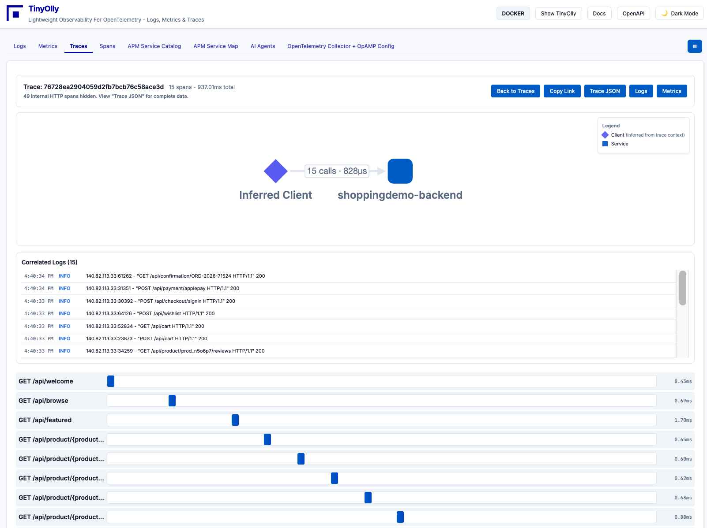
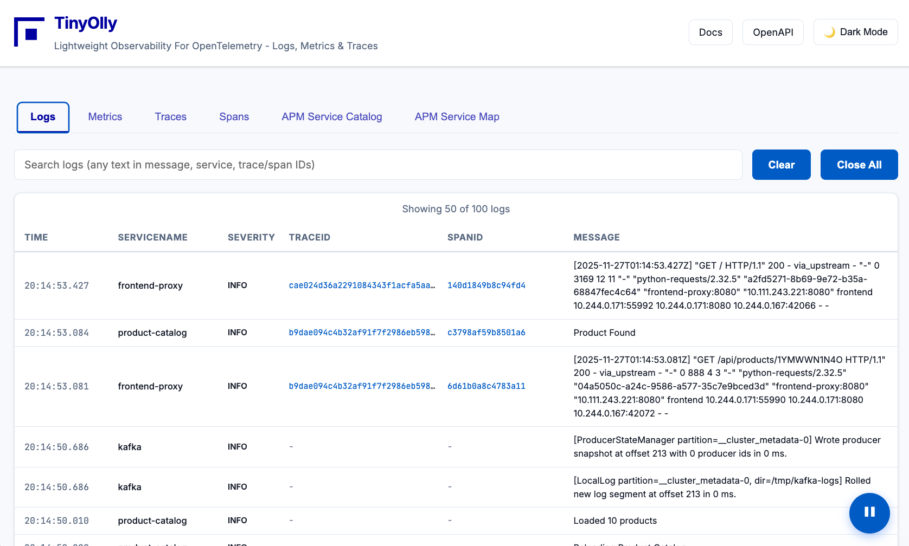

<div align="center">
  
  
  **BYOL (Bring Your Own Laptop) Observability Platform for OpenTelemetry**
</div>

---
## Documentation

Docs are here: [https://tinyolly.github.io/tinyolly/](https://tinyolly.github.io/tinyolly/)  

    

## What is TinyOlly?

Why send telemetry to a cloud observabilty platform while coding? Why not have one on your desktop?  

TinyOlly is a **lightweight OpenTelemetry-native observability platform** built from scratch to visualize and correlate logs, metrics, and traces. No 3rd party observability tools - just Python (FastAPI), Redis, and JavaScript with a **comprehensive REST API**.

- TinyOlly is the world's first desktop development tool to observe and perfect your app's telemetry
- Send telemetry to the locally deployed Otel collector and TinyOlly will visualize it in your browser
- Swap the included Otel collector for your own or any distro for Otel Collector testing- or also relay to a cloud observability platform
- Includes a **REST API** with OpenAPI docs for programmatic access to all telemetry
- TinyOlly is *not* designed to compete with production observability platforms - it is a desktop tool for dev/test

**Platform Support:**  
TinyOlly was built and tested Docker Desktop and Minikube Kubernetes on Apple Silicon Mac but may work on other platforms

<!-- ## Screenshots

<div align="center">
  <table>
    <tr>
      <td align="center" width="50%">
        <br>
        <em>Distributed traces with service correlation</em>
      </td>
      <td align="center" width="50%">
        <br>
        <em>Trace waterfall visualization with span timing</em>
      </td>
    </tr>
    <tr>
      <td align="center" width="50%">
        <br>
        <em>Real-time logs with trace/span linking</em>
      </td>
      <td align="center" width="50%">
        <br>
        <em>Metrics with type-specific visualizations</em>
      </td>
    </tr>
  </table>
</div> -->
---

## Quick Start

All examples are launched from the repo- clone it first:  
```bash
git clone https://github.com/tinyolly/tinyolly
```  

## Docker Deployment

### 1. Deploy TinyOlly Core (Required)

Start the observability backend (OTel Collector, TinyOlly Receiver, Redis, UI):

```bash
cd docker
./01-start-core.sh
```

This starts:
- **TinyOlly OTLP Receiver**: Listening on `localhost:4343` (gRPC)
- **TinyOlly UI**: `http://localhost:5005`
- **TinyOlly Redis**: `localhost:6579` (Moved port to avoid conflict with default Redis)
- **OTel Contrib Collector**: Listening on `localhost:4317` (gRPC) and `localhost:4318` (HTTP) (You can swap this for any distro of Otel Collector)
- Rebuilds images if code changes are detected.

**Open the UI:** `http://localhost:5005` (empty until you send data)

**Stop core services:**
```bash
./02-stop-core.sh
```

---

### 2. Deploy Demo Apps (Optional)

Deploy two Flask microservices with automatic traffic generation:

```bash
cd docker-demo
./01-deploy-demo.sh
```

Wait 30 seconds. **The demo apps automatically generate traffic** - traces, logs, and metrics will appear in the UI!

**Stop demo apps:**
```bash
./02-cleanup-demo.sh
```

This leaves TinyOlly core running. To stop everything:
```bash
cd docker
./02-stop-core.sh
```

---

### 3. OpenTelemetry Demo (~20 Services - Optional)

**Prerequisites:** Clone the OpenTelemetry Demo first:
```bash
git clone https://github.com/open-telemetry/opentelemetry-demo
cd opentelemetry-demo
```

**Configure:** Edit `src/otel-collector/otelcol-config-extras.yml`:
```yaml
exporters:
  otlphttp/tinyolly:
    endpoint: http://otel-collector:4318

service:
  pipelines:
    traces:
      exporters: [spanmetrics, otlphttp/tinyolly]
```

**Deploy:**
```bash
export OTEL_COLLECTOR_HOST=host.docker.internal
docker compose up \
  --scale otel-collector=0 \
  --scale prometheus=0 \
  --scale grafana=0 \
  --scale jaeger=0 \
  --scale opensearch=0 \
  --force-recreate \
  --remove-orphans \
  --detach
```

**Stop:**
```bash
docker compose down
```

> [!NOTE]
> This disables the demo's built-in collector, Jaeger, OpenSearch, Grafana, and Prometheus. All telemetry routes to Otel Collector -> TinyOlly.

---

### 4. Use TinyOlly with Your Own Apps

After deploying TinyOlly core (step 1 above), instrument your application to send telemetry:

**Point your OpenTelemetry exporter to:**
- **gRPC**: `http://otel-collector:4317`
- **HTTP**: `http://otel-collector:4318`

 The Otel Collector will forward everything to TinyOlly's OTLP receiver, which process telemetry and stores it in Redis in OTEL format for the backend and UI to access.

### 5. TinyOlly **Core-Only** Deployment: Use Your Own Docker OpenTelemetry Collector

If you already have an OpenTelemetry Collector or want to send telemetry directly to the TinyOlly Receiver, you can deploy the core components without the bundled OTel Collector.

```bash
cd docker-core-only
docker compose -f docker-compose-tinyolly-core.yml up -d
```

This starts:
- **TinyOlly OTLP Receiver**: Listening on `localhost:4343` (gRPC)
- **TinyOlly UI**: `http://localhost:5005`
- **TinyOlly Redis**: `localhost:6579`

Swap out the included Otel Collector for any distro of Otel Collector.

**Point your OpenTelemetry exporters to tinyolly-otlp-receiver:4343:**
i.e.  
```yaml
exporters:
  debug:
    verbosity: detailed
  
  otlp:
    endpoint: "tinyolly-otlp-receiver:4343"
    tls:
      insecure: true

service:
  pipelines:
    traces:
      receivers: [otlp]
      processors: [batch]
      exporters: [debug, otlp, spanmetrics]
    
    metrics:
      receivers: [otlp,spanmetrics]
      processors: [batch]
      exporters: [debug, otlp]
    
    logs:
      receivers: [otlp]
      processors: [batch]
      exporters: [debug, otlp]
```

The Otel Collector will forward everything to TinyOlly's OTLP receiver, which process telemetry and stores it in Redis in OTEL format for the backend and UI to access.

## Kubernetes Deployment

### Prerequisites

- [Minikube](https://minikube.sigs.k8s.io/docs/start/)
- [kubectl](https://kubernetes.io/docs/tasks/tools/)

### 1. Deploy TinyOlly Core

1.  **Start Minikube:**

    ```bash
    minikube start
    ```

2.  **Build Images:**

    Run the build script to build the Docker images inside Minikube's Docker daemon:

    ```bash
    ./k8s/01-build-images.sh
    ```

3.  **Deploy TinyOlly:**
    
    Run the deployment script to apply the Kubernetes manifests:

    ```bash
    ./k8s/02-deploy-tinyolly.sh
    ```

4.  **Access the UI:**

    To access the TinyOlly UI (Service Type: LoadBalancer) on macOS with Minikube, you need to use `minikube tunnel`.

    Open a **new terminal window** and run:

    ```bash
    minikube tunnel
    ```

    You may be asked for your password. Keep this terminal open.

    Now you can access the TinyOlly UI at: [http://localhost:5002](http://localhost:5002)

5.  **Clean Up:**

    Use the cleanup script to remove all TinyOlly resources:

    ```bash
    ./k8s/03-cleanup.sh
    ```

    Shut down Minikube:
    ```bash
    minikube stop
    ```
    
    Minikube may be more stable if you delete it:
    ```bash
    minikube delete
    ```

---

### 2. Demo Applications (Optional)

To see TinyOlly in action with instrumented microservices:

```bash
cd k8s-demo
./01-deploy.sh
```

To clean up the demo:
```bash
./02-cleanup.sh
```

The demo includes two microservices that automatically generate traffic, showcasing distributed tracing across service boundaries.

---

### 3. OpenTelemetry Demo (~20 Services - Optional)

To deploy the full [OpenTelemetry Demo](https://opentelemetry.io/docs/demo/) with ~20 microservices:

**Prerequisites:**
- TinyOlly must be deployed first (see Setup above)
- [Helm](https://helm.sh/docs/intro/install/) installed
- Sufficient cluster resources (demo is resource-intensive)

**Deploy:**
```bash
cd k8s-otel-demo
./01-deploy-otel-demo-helm.sh
```

This deploys all OpenTelemetry Demo services configured to send telemetry to TinyOlly's collector via HTTP on port 4318. Built-in observability tools (Jaeger, Grafana, Prometheus) are disabled.

**Cleanup:**
```bash
cd k8s-otel-demo
./02-cleanup-otel-demo-helm.sh
```

This removes the OpenTelemetry Demo but leaves TinyOlly running.

### 4. TinyOlly **Core-Only** Deployment: Use Your Own Kubernetes OpenTelemetry Collector

To deploy TinyOlly without the bundled OTel Collector (e.g., if you have an existing collector daemonset):

1.  **Build Images:**
    ```bash
    ./k8s/01-build-images.sh
    ```

2.  **Deploy Core:**
    ```bash
    cd k8s-core-only
    ./deploy.sh
    ```

3.  **Access UI:**
    Run `minikube tunnel` and access `http://localhost:5002`.

4.  **Cleanup:**
    ```bash
    ./cleanup.sh
    ```

---

## Running Docker and Kubernetes Simultaneously

Both environments can run at the same time on the same machine:
- **Docker**: `http://localhost:5005`
- **Kubernetes**: `http://localhost:5002`

Each has its own isolated data and generates independent telemetry streams. Perfect for testing or comparing deployments.

---

## Features

### Modern UI with Auto-Refresh

- **Auto-refresh**: Updates every 5 seconds (can be paused)
- **Copy/Download**: Export JSON with one click
- **Metric Cardinality Display**: Shows current count vs limit (e.g., "276/1000 limit") with warnings at 80%+
- **Clickable Metadata**: Click resource/attribute counts to view detailed breakdowns
- **Full Label Display**: All metric labels shown in chart legends
- **Inline Correlated Logs**: Logs appear in trace waterfall views

- **Service Catalog**: Service directory with RED metrics and inline charts
- **Service Map**: Interactive dependency graph
- **Data Limits**: Last 100 logs, 50 traces to prevent browser overload


### Service Catalog

The **Service Catalog** tab provides a comprehensive directory of all services generating telemetry with advanced features:

#### RED Metrics (Rate, Errors, Duration)
- **Rate**: Requests per second (automatically calculated from spanmetrics)
- **Error Rate**: Percentage of failed requests (based on span status codes)
- **P50/P95**: Latency percentiles in milliseconds
- **Color-Coded Errors**: Visual indicators for error rates (green < 1%, orange < 5%, red ≥ 5%)

#### Interactive Metrics Charts
- **Inline Visualization**: Click any RED metric to view its chart without leaving the catalog
- **Full Label Display**: Shows complete metric name with all labels (e.g., `Counter: traces.span.metrics.calls{service.name="frontend", span.kind="SERVER", status.code="ERROR"}`)
- **Persistent Charts**: Charts remain open during auto-refresh
- **Visual Feedback**: Active metrics are highlighted with a background color
- **Close Button**: Easy dismissal of charts

#### Service Statistics & Navigation
- **Span/Trace Counts**: Total spans and traces per service
- **Timestamps**: First seen and last seen times
- **Quick Filters**: Click "View Spans" or "View Logs" to filter by service
- **Server-Side Filtering**: Efficiently fetches service-specific data from backend
- **Persistent Filters**: Filters survive auto-refresh until manually cleared

#### Sortable Columns
- **Click to Sort**: All columns are sortable (name, rate, errors, P50, P95, spans, traces, timestamps)
- **Sort Indicators**: Visual indicators show current sort direction (ascending, descending, unsorted)
- **Smart Sorting**: Null values always appear at the end
- **Persistent Sort**: Sort settings maintained across refreshes

**Use Case**: Monitor service health at a glance, identify performance issues, drill down into specific services, and analyze RED metrics inline without context switching.

### Service Map

The **Service Map** tab visualizes your microservices architecture in real-time:

#### Node Types (Auto-Detected)
- **Client** (Purple Diamond): Services that only make outbound calls
- **Server** (Blue Rectangle): Services with bidirectional traffic
- **Database/External** (Green Barrel): Services that only receive calls
- **Messaging** (Orange Rhomboid): Message queues (Kafka, RabbitMQ)
- **Isolated** (Gray Circle): Services with no connections yet

#### Features
- **Interactive Graph**: Zoom, pan, and click nodes to explore
- **Call Counts**: Edge labels show number of calls between services
- **Live Updates**: Map refreshes every 5 seconds as relationships form
- **Topology Inference**: Node types determined by traffic patterns
- **All Services Visible**: Shows every service from catalog, even if isolated

**Use Case**: Understand service dependencies, identify bottlenecks, and visualize your distributed system's architecture.

### Cardinality Protection

TinyOlly includes built-in protection against metric cardinality explosion:
- **Hard Limit**: 1000 unique metric names by default (configurable)
- **Visual Warnings**: UI alerts when approaching the limit (70%, 90%)
- **Drop & Track**: Metrics exceeding the limit are dropped and tracked for debugging
- **Stats Display**: Shows `current / max (dropped)` in the UI

**Configuration:**
```bash
# Kubernetes
kubectl set env deployment/tinyolly-otlp-receiver MAX_METRIC_CARDINALITY=2000

# Docker
docker run -e MAX_METRIC_CARDINALITY=2000 ...
```

See [docs/CARDINALITY-PROTECTION.md](docs/CARDINALITY-PROTECTION.md) for detailed documentation.

---

## REST API & OpenAPI

TinyOlly provides a comprehensive REST API for programmatic access to all telemetry data in **OpenTelemetry-native format**.

### Interactive API Documentation

Access the auto-generated OpenAPI documentation:
- **Swagger UI**: `http://localhost:5005/docs` - Interactive API explorer
- **ReDoc**: `http://localhost:5005/redoc` - Alternative documentation
- **OpenAPI Spec**: `http://localhost:5005/openapi.json` - Machine-readable schema

All APIs return **OpenTelemetry-native JSON** with:
- **Resources**: `service.name`, `host.name`, etc.
- **Attributes**: Metric labels and span attributes

- **Full Context**: Trace/span IDs, timestamps, status codes

## Technical Details

### Architecture

```
Demo Frontend  ←→  Demo Backend (distributed tracing + auto-traffic)
        ↓                    ↓
   OTel Collector  ←─────────┘
        ↓
   TinyOlly OTLP Receiver (Async FastAPI, parses OTLP, stores in Redis)
        ↓
   Redis (30-minute TTL with cardinality protection)
        ↓
   TinyOlly UI & REST API (FastAPI + HTML + JavaScript)
```

### Data Storage

- **Format**: Full OpenTelemetry (OTEL) format for traces, logs, and metrics
- **Redis**: All telemetry stored with 30-minute TTL (compressed with ZSTD + msgpack)
- **Sorted Sets**: Time-series data indexed by timestamp
- **Correlation**: Native trace-metric-log correlation via trace/span IDs
- **Cardinality Protection**: Prevents metric explosion
- **No Persistence**: Data vanishes after TTL (ephemeral dev tool)

### OTLP Compatibility

TinyOlly is **fully OpenTelemetry-native**:
- **Ingestion**: Accepts OTLP/gRPC (primary) and OTLP/HTTP
- **Storage**: Stores traces, logs, and metrics in full OTEL format with resources, scopes, and attributes
- **Correlation**: Native support for trace/span ID correlation across all telemetry types

- **Spanmetrics Integration**: Automatically generates RED metrics from traces via OTel Collector
- **REST API**: Exposes OTEL-formatted JSON for programmatic access
- **No Vendor Lock-in**: Standard formats, no proprietary schemas or SDKs required

#### Full OTEL Format Support
- **Traces**: ResourceSpans with full span attributes, events, links, and status
- **Logs**: ResourceLogs with trace/span context injection for correlation
- **Metrics**: ResourceMetrics with type detection (Gauge, Sum, Histogram, Summary, ExponentialHistogram)
- **Resources**: Service name, host, deployment environment, etc.
- **Attributes**: Labels, tags, and metadata at resource and data point levels

---
## Licensing

TinyOlly is released under the **BSD 3-Clause License**.  
The full license text is available in the [`LICENSE`](./LICENSE) file. This license permits free use, modification, and redistribution for individuals, researchers, and small organizations.

### Community and Small-Scale Use
TinyOlly may be used freely under the BSD license for:

- Individual developers and hobby projects  
- Academic and research use  
- Startups or small organizations  
- Limited internal development, tooling, experimentation, or evaluation  

No additional agreements are required for these scenarios.

### Commercial and Large-Scale Use
Organizations deploying TinyOlly in a broader or more intensive capacity are required to obtain a commercial license. This includes use cases such as:

- Organizations with approximately 50 or more employees  
- Deployments across multiple engineering teams  
- Production or mission-critical observability workflows  
- Integration into commercial software, platforms, or SaaS products  
- High-volume or distributed environments

For commercial licensing inquiries, contact:  
<div align="center">
  
</div>

### Rationale
This model ensures that TinyOlly remains fully open source and accessible to the community while providing a sustainable path for supporting organizations that rely on it at scale.

---

<div align="center">
  <p>Built for the OpenTelemetry community</p>
  <p>
    <a href="https://github.com/tinyolly/tinyolly">GitHub</a> •
    <a href="https://github.com/tinyolly/tinyolly/issues">Issues</a>
  </p>
</div>