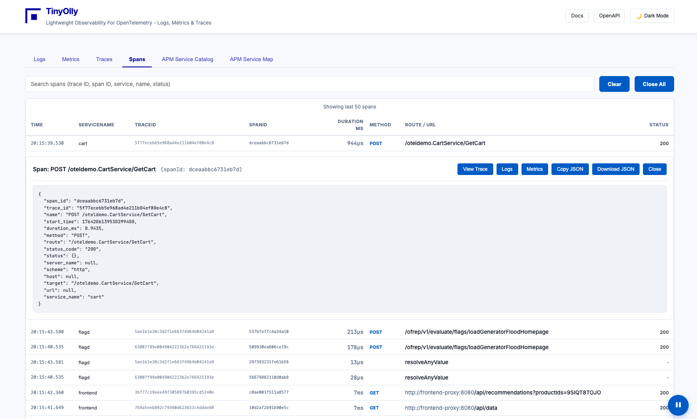

# Cardinality Protection

<div align="center">
  
  <p><em>Span waterfall showing distributed trace complexity</em></p>
</div>

---

TinyOlly includes built-in protection against metric cardinality explosion with a configurable limit on unique metric names.

## Configuration

### Environment Variables

| Variable | Default | Description |
|----------|---------|-------------|
| `MAX_METRIC_CARDINALITY` | 1000 | Maximum unique metric names |
| `SQLITE_TTL_SECONDS` | 1800 | Data retention in seconds (alias: `REDIS_TTL`) |

### Kubernetes Deployment

Update `k8s/tinyolly-otlp-receiver.yaml`:

```yaml
env:
  - name: MAX_METRIC_CARDINALITY
    value: "2000"  # Increase limit
  - name: SQLITE_TTL_SECONDS
    value: "3600"  # 1 hour retention
```

### Docker Deployment

Update `docker-compose-tinyolly-core.yml` in the `docker/` directory:

```yaml
environment:
  MAX_METRIC_CARDINALITY: 2000
  SQLITE_TTL_SECONDS: 3600
```

## Monitoring

The UI displays cardinality warnings when approaching the limit:
- **Yellow Warning:** 70-90% of limit reached
- **Red Alert:** 90%+ of limit reached

Check current cardinality via the API:

```bash
curl http://localhost:5005/api/stats
```

Response:
```json
{
  "traces": 145,
  "logs": 892,
  "metrics": 850,
  "metrics_max": 1000,
  "metrics_dropped": 23
}
```
