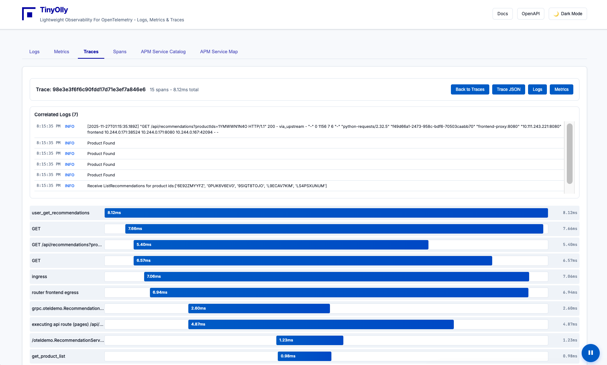

# Docker Deployment

Get TinyOlly running on Docker in minutes!

<div align="center">
  
  <p><em>TinyOlly UI showing distributed traces</em></p>
</div>

---

All examples are launched from the repo - clone it first or download the current GitHub release archive:
```bash
git clone https://github.com/tinyolly/tinyolly
```

## 1. Deploy TinyOlly Core (Required)

Start the observability backend (OTel Collector, TinyOlly Receiver, Redis, UI):

```bash
cd docker
./01-start-core.sh
```

This starts:
- **OTel Collector**: Listening on `localhost:4317` (gRPC) and `localhost:4318` (HTTP)  
- **OpAMP Server**: `ws://localhost:4320/v1/opamp` (WebSocket), `localhost:4321` (HTTP REST API)  
- **TinyOlly UI**: `http://localhost:5005`  
- **TinyOlly OTLP Receiver and its Redis storage**: OTLP observability back end and storage  
- Rebuilds images if code changes are detected  

**Open the UI:** `http://localhost:5005` (empty until you send data)

**Stop core services:**
```bash
./02-stop-core.sh
```

---

## 2. Deploy Demo Apps (Optional)

Deploy two Flask microservices with automatic traffic generation:

```bash
cd docker-demo
./01-deploy-demo.sh
```

Wait 30 seconds. **The demo apps automatically generate traffic** - traces, logs, and metrics will appear in the UI!

**Stop demo apps:**
```bash
./02-cleanup-demo.sh
```

This leaves TinyOlly core running. To stop everything:
```bash
cd docker
./02-stop-core.sh
```

---

## 3. OpenTelemetry Demo (~20 Services - Optional)

**Prerequisites:** Clone the OpenTelemetry Demo first:
```bash
git clone https://github.com/open-telemetry/opentelemetry-demo
cd opentelemetry-demo
```

**Configure:** Edit `src/otel-collector/otelcol-config-extras.yml`:
```yaml
exporters:
  otlphttp/tinyolly:
    endpoint: http://otel-collector:4318

service:
  pipelines:
    traces:
      exporters: [spanmetrics, otlphttp/tinyolly]
```

**Deploy:**
```bash
export OTEL_COLLECTOR_HOST=host.docker.internal
docker compose up \
  --scale otel-collector=0 \
  --scale prometheus=0 \
  --scale grafana=0 \
  --scale jaeger=0 \
  --scale opensearch=0 \
  --force-recreate \
  --remove-orphans \
  --detach
```

**Stop:**
```bash
docker compose down
```

!!! note
    This disables the demo's built-in collector, Jaeger, OpenSearch, Grafana, and Prometheus. All telemetry routes to Otel Collector -> TinyOlly.

---

## 4. Use TinyOlly with Your Own Apps

After deploying TinyOlly core (step 1 above), instrument your application to send telemetry:

**For apps running in Docker containers:**  
Point your OpenTelemetry exporter to:  
- **gRPC**: `http://otel-collector:4317`  
- **HTTP**: `http://otel-collector:4318`  

**For apps running on your host machine (outside Docker):**  
Docker Desktop automatically exposes container ports to `localhost`. Point your OpenTelemetry exporter to:  
- **gRPC**: `http://localhost:4317`  
- **HTTP**: `http://localhost:4318`  

**Example environment variables:**
```bash
export OTEL_EXPORTER_OTLP_ENDPOINT=http://localhost:4318
```

The Otel Collector will forward everything to TinyOlly's OTLP receiver, which process telemetry and stores it in Redis in OTEL format for the backend and UI to access.

## 5. TinyOlly **Core-Only** Deployment: Use Your Own Docker OpenTelemetry Collector

If you already have an OpenTelemetry Collector or want to send telemetry directly to the TinyOlly Receiver, you can deploy the core components without the bundled OTel Collector.

```bash
cd docker-core-only
./01-start-core.sh
```

This starts:
- **TinyOlly OTLP Receiver**: Listening on `localhost:4343` (gRPC only)
- **OpAMP Server**: `ws://localhost:4320/v1/opamp` (WebSocket), `localhost:4321` (HTTP REST API)
- **TinyOlly UI**: `http://localhost:5005`
- **TinyOlly Redis**: `localhost:6579`

Swap out the included Otel Collector for any distro of Otel Collector.

**Point your OpenTelemetry exporters to tinyolly-otlp-receiver:4343:**
i.e.  
```yaml
exporters:
  debug:
    verbosity: detailed
  
  otlp:
    endpoint: "tinyolly-otlp-receiver:4343"
    tls:
      insecure: true

service:
  pipelines:
    traces:
      receivers: [otlp]
      processors: [batch]
      exporters: [debug, otlp, spanmetrics]
    
    metrics:
      receivers: [otlp,spanmetrics]
      processors: [batch]
      exporters: [debug, otlp]
    
    logs:
      receivers: [otlp]
      processors: [batch]
      exporters: [debug, otlp]
```

The Otel Collector will forward everything to TinyOlly's OTLP receiver, which process telemetry and stores it in Redis in OTEL format for the backend and UI to access.

**OpAMP Configuration (Optional):**

To enable remote configuration management via TinyOlly UI, add the OpAMP extension to your collector config:

```yaml
extensions:
  opamp:
    server:
      ws:
        endpoint: ws://localhost:4320/v1/opamp

service:
  extensions: [opamp]
```

The default configuration template (located at `docker/otelcol-configs/config.yaml`) shows a complete example with OTLP receivers, OpAMP extension, batch processing, and spanmetrics connector. Your collector will connect to the OpAMP server and receive configuration updates through the TinyOlly UI.

**Stop core-only services:**
```bash
./02-stop-core.sh
```
