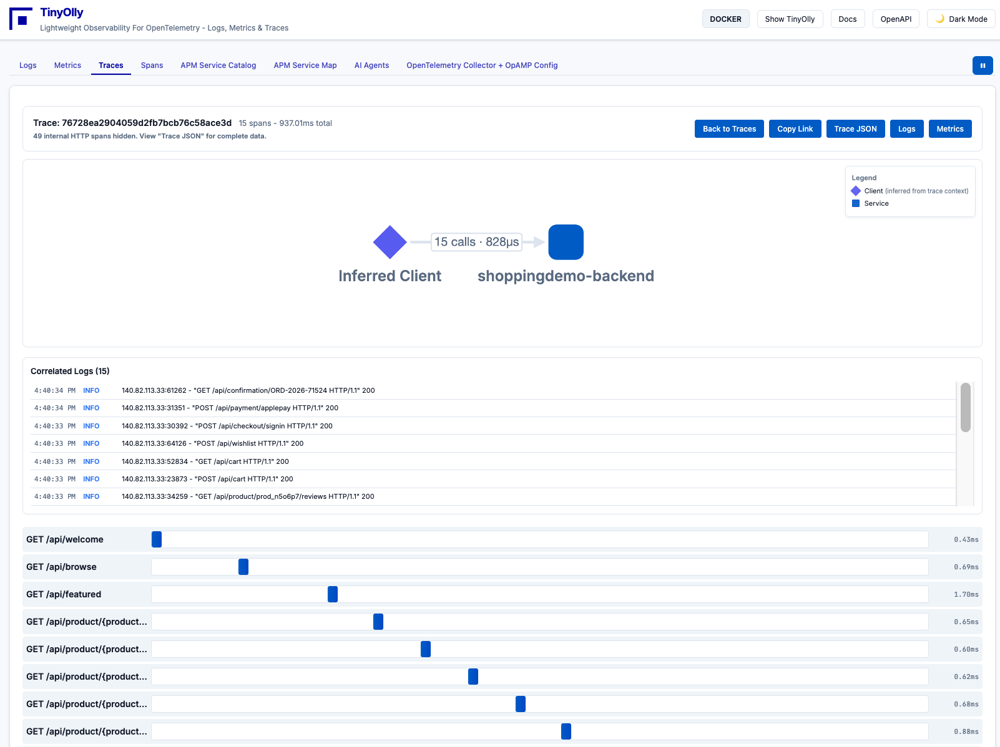
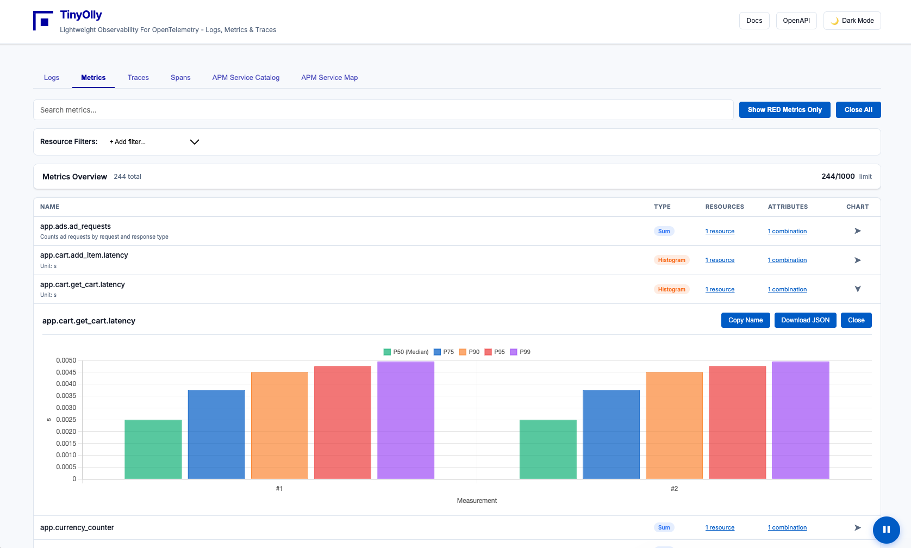
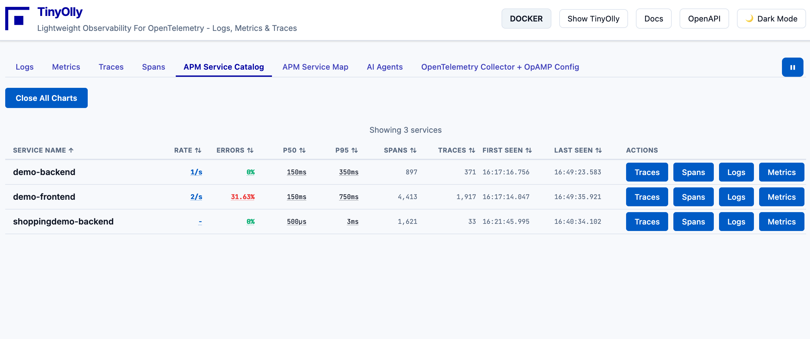

<div align="center">
  <br>
  <b>The World's First Desktop Observability Platform</b>
</div>  

---

## Introducing TinyOlly

**Repository:** [https://github.com/tinyolly/tinyolly](https://github.com/tinyolly/tinyolly)

```bash
git clone https://github.com/tinyolly/tinyolly
```

### Why TinyOlly?

Why send telemetry to a cloud observability platform while coding? Why not have one on your desktop?

TinyOlly is a **lightweight OpenTelemetry-native observability platform** built from scratch to visualize and correlate logs, metrics, and traces. No 3rd party observability tools - just Python (FastAPI), SQLite, OpenAPI, and JavaScript.

### Key Features

- **Development-focused** - Perfect your app's telemetry locally before production
- **Full OpenTelemetry support** - Native OTLP ingestion (gRPC & HTTP)
- **Pre-built Docker images** - Deploy in ~30 seconds from Docker Hub
- **Multi-architecture** - Supports linux/amd64 and linux/arm64 (Apple Silicon)
- **Trace correlation** - Link logs, metrics, and traces automatically
- **Metrics Explorer** - Analyze cardinality, labels, and raw series data
- **Service catalog** - RED metrics (Rate, Errors, Duration) for all services
- **Interactive service map** - Visualize dependencies and call graphs
- **OpenTelemetry Collector management** - Remote configuration management via OpAMP protocol
- **REST API** - Programmatic access with OpenAPI documentation
- **Zero vendor lock-in** - Works with any OTel Collector distribution

!!! note "Local Development Only"
    TinyOlly is *not* designed to compete with production observability platforms! It's for local development only and is not focused on infrastructure monitoring at this time.

### Platform Support

Tested on:

- Docker Desktop (macOS Apple Silicon)
- Minikube Kubernetes (macOS Apple Silicon)
- May work on other platforms

### Quick Start

Ready to try TinyOlly? Check out the [Quick Start Guide](quickstart.md) to get running in under 5 minutes!

---

## Screenshots

<div align="center">
  <table>
    <tr>
      <td align="center" width="33%">
        <br>
        <em>Trace Waterfall with Correlated Logs</em>
      </td>
      <td align="center" width="33%">
        <br>
        <em>Real-time Logs with Filtering</em>
      </td>
      <td align="center" width="33%">
        <br>
        <em>Metrics with Chart Visualization</em>
      </td>
    </tr>
    <tr>
      <td align="center" width="33%">
        <br>
        <em>Service Catalog with RED Metrics</em>
      </td>
      <td align="center" width="33%">
        <br>
        <em>Interactive Service Dependency Map</em>
      </td>
      <td align="center" width="33%">
        <br>
        <em>OTel Collector Configuration (OpAMP)</em>
      </td>
    </tr>
  </table>
</div>

---

<div align="center">
  <p>Built for the OpenTelemetry community</p>
  <p>
    <a href="https://github.com/tinyolly/tinyolly">GitHub</a> •
    <a href="https://github.com/tinyolly/tinyolly/issues">Issues</a>
  </p>
</div>

