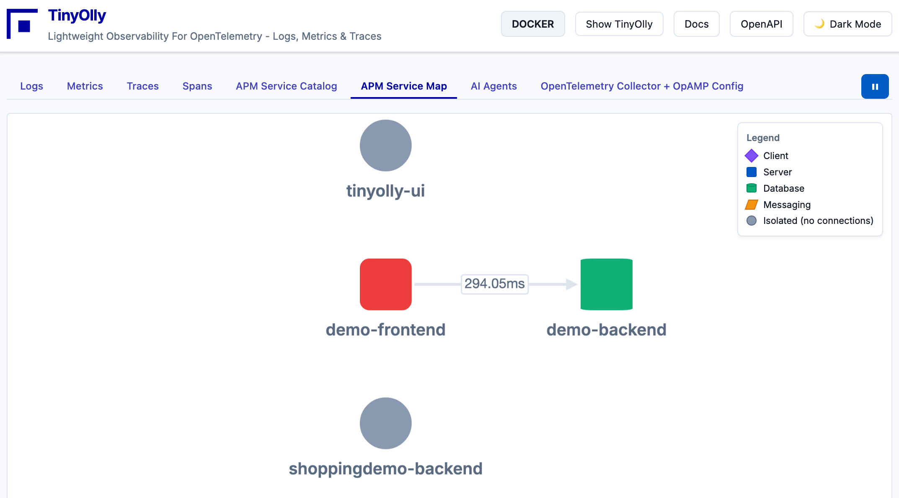

# Kubernetes Deployment

Deploy TinyOlly on Kubernetes (Minikube) for local development!

<div align="center">
  
  <p><em>Service map showing microservices running on Kubernetes</em></p>
</div>

---

All examples are launched from the repo - clone it first or download the current GitHub release archive:
```bash
git clone https://github.com/tinyolly/tinyolly
```

## Prerequisites

- [Minikube](https://minikube.sigs.k8s.io/docs/start/)
- [kubectl](https://kubernetes.io/docs/tasks/tools/)

## 1. Deploy TinyOlly Core

1.  **Start Minikube:**

    ```bash
    minikube start
    ```

2.  **Deploy TinyOlly:**

    Images will be pulled from Docker Hub automatically:

    ```bash
    ./k8s/02-deploy-tinyolly.sh
    ```

    Alternatively, you can manually apply all manifests with `kubectl apply -f k8s/`

    !!! note "Local Development Build (Optional)"
        To build images locally for Minikube instead of pulling from Docker Hub:
        ```bash
        ./build/local/build-core-minikube.sh
        ```

3.  **Access the UI:**

    To access the TinyOlly UI (Service Type: LoadBalancer) on macOS with Minikube, you need to use `minikube tunnel`.

    Open a **new terminal window** and run:

    ```bash
    minikube tunnel
    ```

    You may be asked for your password. Keep this terminal open.

    Now you can access the TinyOlly UI at: [http://localhost:5002](http://localhost:5002)

    **OpenTelemetry Collector + OpAMP Config Page:** Navigate to the "OpenTelemetry Collector + OpAMP Config" tab in the UI to view and manage collector configurations remotely. See the [OpAMP Configuration](#opamp-configuration-optional) section below for setup instructions.

4.  **Send Telemetry from Host Apps:**

    To send telemetry from applications running on your host machine (outside Kubernetes), use `kubectl port-forward` to expose the OTel Collector ports:

    Open a **new terminal window** and run:

    ```bash
    kubectl port-forward service/otel-collector 4317:4317 4318:4318
    ```

    Keep this terminal open. Now point your application's OpenTelemetry exporter to:  
    - **gRPC**: `http://localhost:4317`  
    - **HTTP**: `http://localhost:4318`  

    **Example environment variables:**
    ```bash
    export OTEL_EXPORTER_OTLP_ENDPOINT=http://localhost:4318
    ```

    **For apps running inside the Kubernetes cluster:**  
    Use the Kubernetes service name:  
    - **gRPC**: `http://otel-collector:4317`  
    - **HTTP**: `http://otel-collector:4318`  

5.  **Clean Up:**

    Use the cleanup script to remove all TinyOlly resources:

    ```bash
    ./k8s/03-cleanup.sh
    ```

    Shut down Minikube:
    ```bash
    minikube stop
    ```
    
    Minikube may be more stable if you delete it:
    ```bash
    minikube delete
    ```

---

## 2. Demo Applications (Optional)

To see TinyOlly in action with instrumented microservices:

```bash
cd k8s-demo
./02-deploy.sh
```

The deploy script pulls demo images from Docker Hub by default. For local development, you can build images locally when prompted.

To clean up the demo:
```bash
./03-cleanup.sh
```

The demo includes two microservices that automatically generate traffic, showcasing distributed tracing across service boundaries.

---

## 3. OpenTelemetry Demo (~20 Services - Optional)

To deploy the full [OpenTelemetry Demo](https://opentelemetry.io/docs/demo/) with ~20 microservices:

**Prerequisites:**  
- TinyOlly must be deployed first (see Setup above)  
- [Helm](https://helm.sh/docs/intro/install/) installed  
- Sufficient cluster resources (demo is resource-intensive)  

**Deploy:**
```bash
cd k8s-otel-demo
./01-deploy-otel-demo-helm.sh
```

This deploys all OpenTelemetry Demo services configured to send telemetry to TinyOlly's collector via HTTP on port 4318. Built-in observability tools (Jaeger, Grafana, Prometheus) are disabled.

**Cleanup:**
```bash
cd k8s-otel-demo
./02-cleanup-otel-demo-helm.sh
```

This removes the OpenTelemetry Demo but leaves TinyOlly running.

## 4. TinyOlly **Core-Only** Deployment: Use Your Own Kubernetes OpenTelemetry Collector

To deploy TinyOlly without the bundled OTel Collector (e.g., if you have an existing collector daemonset). Includes OpAMP server for optional remote collector configuration management:

1.  **Deploy Core:**
    ```bash
    cd k8s-core-only
    ./01-deploy.sh
    ```

2.  **Access UI:**
    Run `minikube tunnel` and access `http://localhost:5002`.

3.  **Cleanup:**
    ```bash
    ./02-cleanup.sh
    ```

### Use TinyOlly with Any OpenTelemetry Collector

Swap out the included Otel Collector for any distro of Otel Collector.

**Point your OpenTelemetry exporters to tinyolly-otlp-receiver:4343:**
i.e.  
```yaml
exporters:
  debug:
    verbosity: detailed
  
  otlp:
    endpoint: "tinyolly-otlp-receiver:4343"
    tls:
      insecure: true

service:
  pipelines:
    traces:
      receivers: [otlp]
      processors: [batch]
      exporters: [debug, otlp, spanmetrics]
    
    metrics:
      receivers: [otlp,spanmetrics]
      processors: [batch]
      exporters: [debug, otlp]
    
    logs:
      receivers: [otlp]
      processors: [batch]
      exporters: [debug, otlp]
```

The Otel Collector will forward everything to TinyOlly's OTLP receiver, which processes telemetry and stores it in SQLite in OTEL format for the backend and UI to access.

## OpAMP Configuration (Optional)

The **OpenTelemetry Collector + OpAMP Config** page in the TinyOlly UI allows you to view and manage collector configurations remotely. To enable this feature, add the OpAMP extension to your collector config:

```yaml
extensions:
  opamp:
    server:
      ws:
        endpoint: ws://tinyolly-opamp-server:4320/v1/opamp

service:
  extensions: [opamp]
```

The default configuration template (included as a ConfigMap in `k8s-core-only/tinyolly-opamp-server.yaml`) shows a complete example with OTLP receivers, OpAMP extension, batch processing, and spanmetrics connector. Your collector will connect to the OpAMP server and receive configuration updates through the TinyOlly UI.

---

## Building Images

By default, deployment scripts pull pre-built images from Docker Hub. For building images locally (Minikube) or publishing to Docker Hub, see [build/README.md](https://github.com/tinyolly/tinyolly/blob/main/build/README.md).

---

