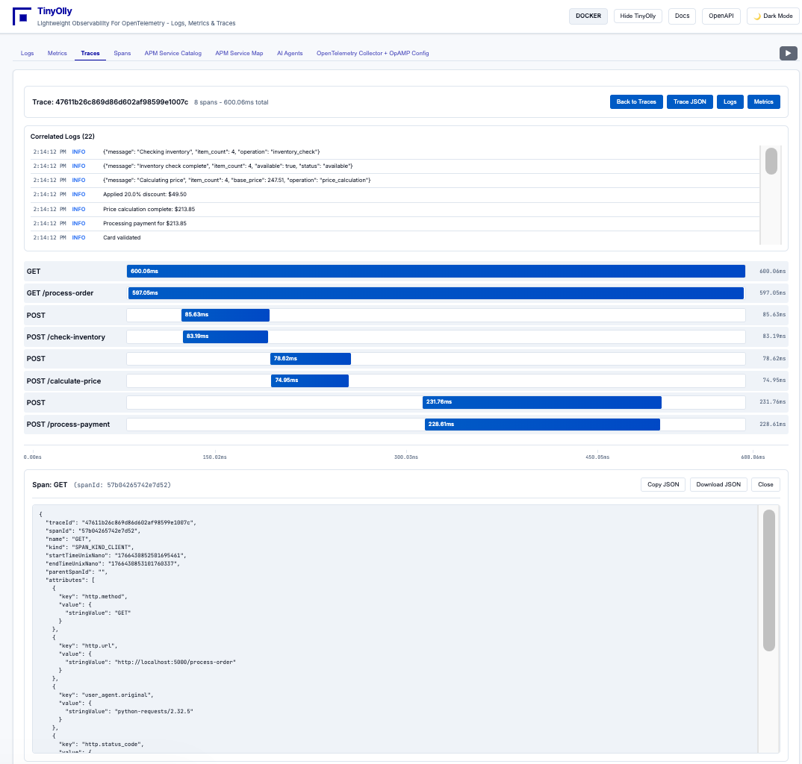
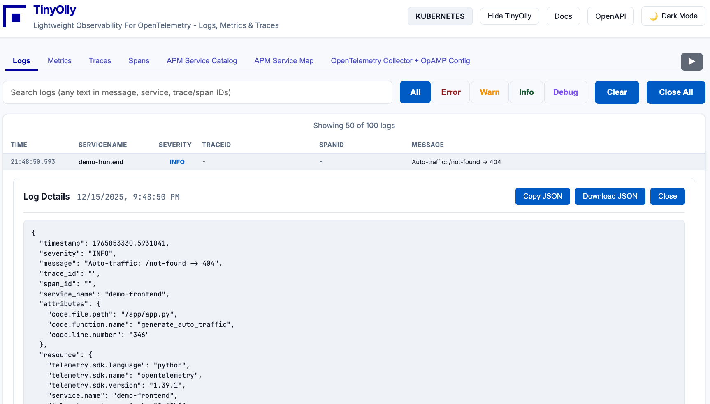
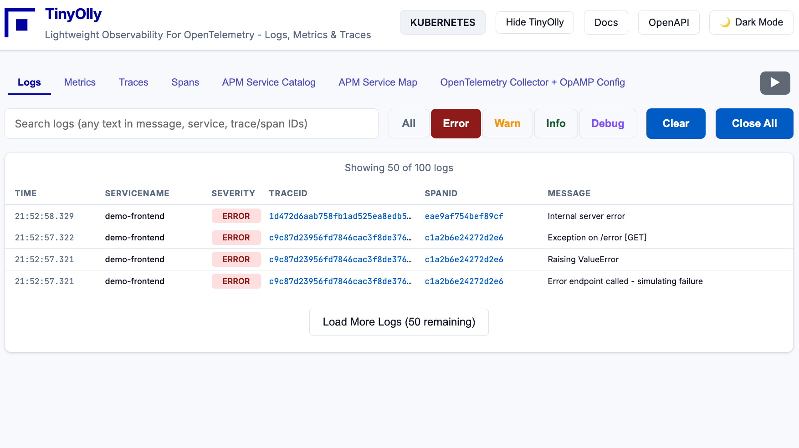
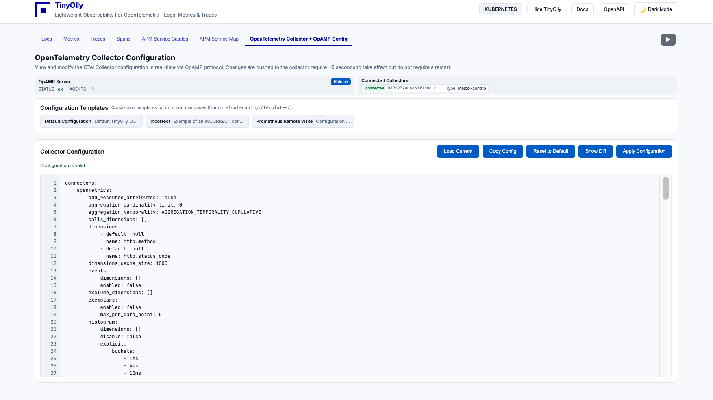

# Quick Start

Get TinyOlly running in under 5 minutes!

## What You'll Get

- **TinyOlly UI** at `http://localhost:5005`
- **OpenTelemetry Collector** listening on ports 4317 (gRPC) and 4318 (HTTP)
- **OpAMP Server** for remote collector configuration management
- **Demo microservices** generating automatic telemetry

---

## Prerequisites

- Docker Desktop installed and running
- Git (to clone the repository)
- 5 minutes of your time

---

## Step 1: Clone the Repository

```bash
git clone https://github.com/tinyolly/tinyolly
cd tinyolly
```

---

## Step 2: Start TinyOlly Core

```bash
cd docker
./01-start-core.sh
```

This pulls pre-built images from Docker Hub and starts:

- **OpenTelemetry Collector** (ports 4317/4318)
- **OpAMP Server** (ports 4320/4321)
- **TinyOlly OTLP Receiver** (internal)
- **TinyOlly UI** (port 5005)
- **Redis storage** (internal)

**Deployment time:** ~30 seconds (pulls from Docker Hub)

**For local development:** Use `./01-start-core-local.sh` to build images locally.

---

## Step 3: Deploy Demo Apps (Optional but Recommended)

In a new terminal:

```bash
cd docker-demo
./01-deploy-demo.sh
```

This pulls demo images from Docker Hub and deploys two Flask microservices that automatically generate traffic.

**Wait 30 seconds** for telemetry to appear!

**For local development:** Use `./01-deploy-demo-local.sh` to build images locally.

---

## Step 4: Open the UI

Open your browser to: **`http://localhost:5005`**

You should see:

<div align="center">
  
  <p><em>Trace waterfall with correlated logs and span timing</em></p>
</div>

---

## Step 5: Explore the Features

### Traces Tab
View distributed traces across microservices with timing waterfall.

<div align="center">
  
  <p><em>Span waterfall showing request timing breakdown with correlated logs</em></p>
</div>

Click on a span to view detailed JSON data:

<div align="center">
  
  <p><em>Span detail view with full OpenTelemetry attributes</em></p>
</div>

### Logs Tab
Browse logs with trace/span correlation. Filter by severity (Error, Warn, Info, Debug).

<div align="center">
  
  <p><em>Real-time logs with trace and span correlation</em></p>
</div>

Click on a log entry to view full details:

<div align="center">
  
  <p><em>Log detail view with full attributes and resource info</em></p>
</div>

Filter to show only errors:

<div align="center">
  
  <p><em>Filtered error logs with trace correlation</em></p>
</div>

### Metrics Tab
Visualize metrics with automatic charting.

<div align="center">
  
  <p><em>Time-series metrics visualization with rate charts</em></p>
</div>

### Service Catalog
View all services with RED metrics (Rate, Errors, Duration).

<div align="center">
  
  <p><em>Service catalog with RED metrics for all services</em></p>
</div>

### Service Map
Visualize service dependencies with an interactive graph.

<div align="center">
  
  <p><em>Interactive service dependency map with latency information</em></p>
</div>

### OpenTelemetry Collector + OpAMP Config
View and manage your OpenTelemetry Collector configuration remotely via the OpAMP protocol.

<div align="center">
  
  <p><em>OpenTelemetry Collector configuration management via OpAMP</em></p>
</div>

This page allows you to:

- **View current configuration** from connected collectors
- **Apply configuration changes** with validation and diff preview
- **Use configuration templates** for common scenarios (default, prometheus-remote-write, etc.)
- **Check OpAMP server status** and see connected collector agents
- **Validate configurations** before applying to catch errors early

To use this feature, your OpenTelemetry Collector must be configured with the OpAMP extension (see [Docker Deployment](docker.md#opamp-configuration-optional) or [OpenTelemetry Collector](otel-collector.md#opamp-configuration-optional) documentation).

---

## Step 6: Use Your Own Application

Point your application's OpenTelemetry exporter to:

**For apps running on your host machine (outside Docker):**
```bash
export OTEL_EXPORTER_OTLP_ENDPOINT=http://localhost:4318
```

**For apps running inside Docker:**
```bash
export OTEL_EXPORTER_OTLP_ENDPOINT=http://otel-collector:4318
```

TinyOlly will automatically capture and display your telemetry!

---

## Cleanup

Stop demo apps (keeps TinyOlly running):
```bash
cd docker-demo
./02-cleanup-demo.sh
```

Stop everything:
```bash
cd docker
./02-stop-core.sh
```

---

## Next Steps

- [Configure your own OpenTelemetry Collector](otel-collector.md)
- [Explore the REST API](api.md) at `http://localhost:5005/docs`
- [Deploy on Kubernetes](kubernetes.md)
- [Learn about the architecture](technical.md)

---

## Troubleshooting

### UI shows "No traces/logs/metrics"
- Wait 30 seconds after starting demo apps
- Check containers are running: `docker ps`
- Check demo app logs: `docker compose -f docker-demo/docker-compose-demo.yml logs`

### Port conflicts
- TinyOlly uses ports 4317, 4318, 4320, 4321, 4343, 5005, 6579, 19291
- Stop conflicting services or modify ports in `docker-compose-tinyolly-core.yml`

### Demo apps not generating traffic
- Restart demo: `cd docker-demo && ./02-cleanup-demo.sh && ./01-deploy-demo.sh`
- Check logs: `docker compose -f docker-demo/docker-compose-demo.yml logs demo-frontend`

For more help, [open an issue on GitHub](https://github.com/tinyolly/tinyolly/issues).
