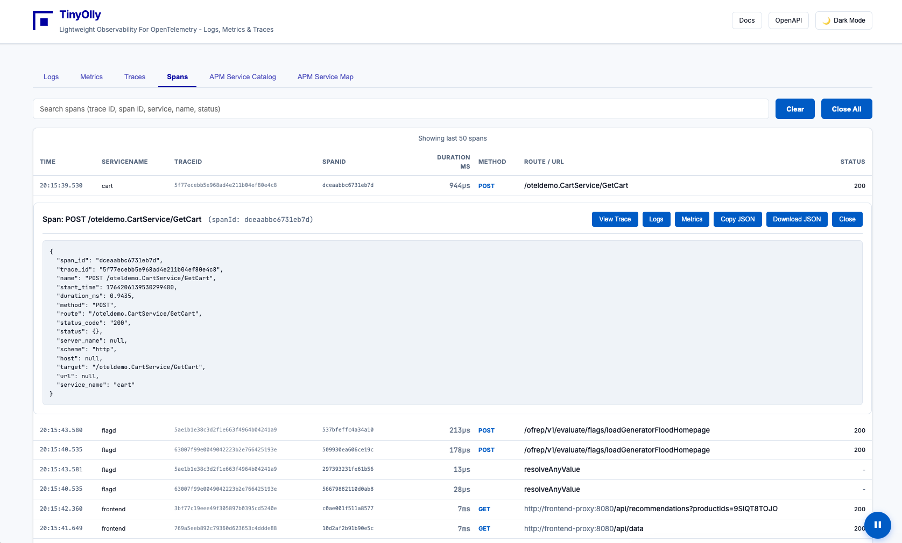
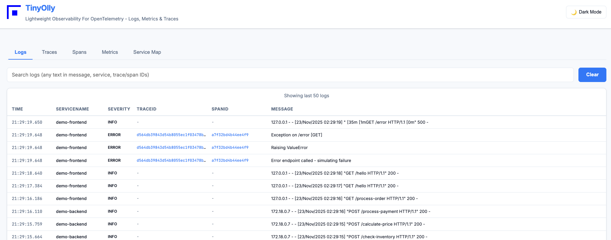
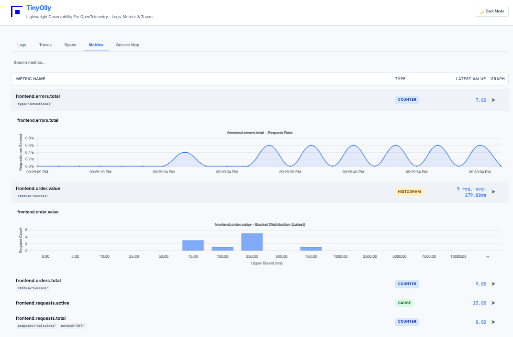
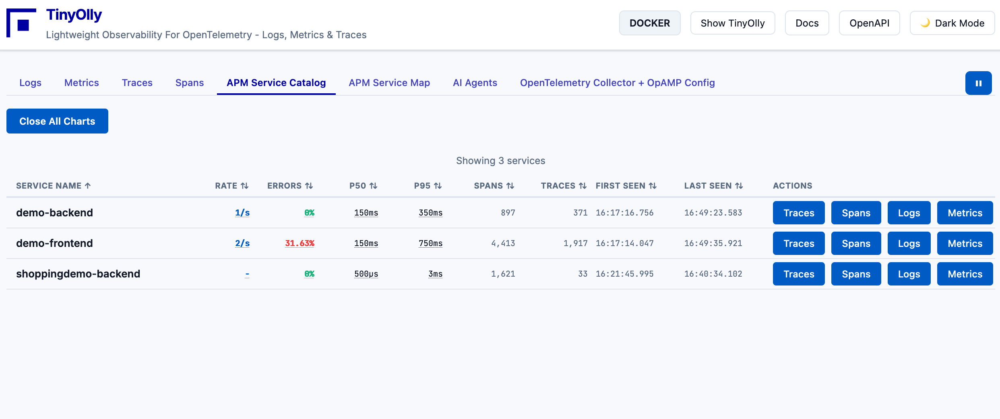
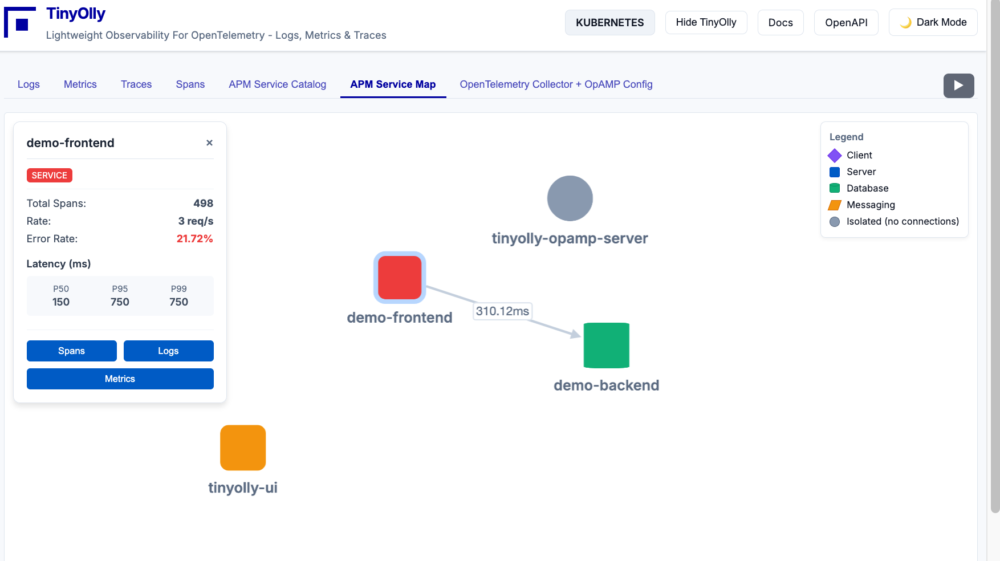

# Quick Start

Get TinyOlly running in under 5 minutes!

## What You'll Get

- **TinyOlly UI** at `http://localhost:5005`
- **OpenTelemetry Collector** listening on ports 4317 (gRPC) and 4318 (HTTP)
- **OpAMP Server** for remote collector configuration management
- **Demo microservices** generating automatic telemetry

---

## Prerequisites

- Docker Desktop installed and running
- Git (to clone the repository)
- 5 minutes of your time

---

## Step 1: Clone the Repository

```bash
git clone https://github.com/tinyolly/tinyolly
cd tinyolly
```

---

## Step 2: Start TinyOlly Core

```bash
cd docker
./01-start-core.sh
```

This starts:

- **OpenTelemetry Collector** (ports 4317/4318)
- **OpAMP Server** (ports 4320/4321)
- **TinyOlly OTLP Receiver** (internal)
- **TinyOlly UI** (port 5005)
- **Redis storage** (internal)

Wait for the containers to start (~30 seconds).

---

## Step 3: Deploy Demo Apps (Optional but Recommended)

In a new terminal:

```bash
cd docker-demo
./01-deploy-demo.sh
```

This deploys two Flask microservices that automatically generate traffic.

**Wait 30 seconds** for telemetry to appear!

---

## Step 4: Open the UI

Open your browser to: **`http://localhost:5005`**

You should see:

<div align="center">
  
  <p><em>Distributed traces view with service correlation</em></p>
</div>

---

## Step 5: Explore the Features

### Traces Tab
View distributed traces across microservices with timing waterfall.

<div align="center">
  
  <p><em>Span waterfall showing request timing breakdown</em></p>
</div>

### Logs Tab
Browse logs with trace/span correlation.

<div align="center">
  
  <p><em>Real-time logs with trace and span correlation</em></p>
</div>

### Metrics Tab
Visualize metrics with automatic charting.

<div align="center">
  
  <p><em>Time-series metrics visualization</em></p>
</div>

### Service Catalog
View all services with RED metrics (Rate, Errors, Duration).

<div align="center">
  
  <p><em>Service catalog with RED metrics for all services</em></p>
</div>

### Service Map
Visualize service dependencies with an interactive graph.

<div align="center">
  
  <p><em>Interactive service dependency map</em></p>
</div>

---

## Step 6: Use Your Own Application

Point your application's OpenTelemetry exporter to:

**For apps running on your host machine (outside Docker):**
```bash
export OTEL_EXPORTER_OTLP_ENDPOINT=http://localhost:4318
```

**For apps running inside Docker:**
```bash
export OTEL_EXPORTER_OTLP_ENDPOINT=http://otel-collector:4318
```

TinyOlly will automatically capture and display your telemetry!

---

## Cleanup

Stop demo apps (keeps TinyOlly running):
```bash
cd docker-demo
./02-cleanup-demo.sh
```

Stop everything:
```bash
cd docker
./02-stop-core.sh
```

---

## Next Steps

- [Configure your own OpenTelemetry Collector](otel-collector.md)
- [Explore the REST API](api.md) at `http://localhost:5005/docs`
- [Deploy on Kubernetes](kubernetes.md)
- [Learn about the architecture](technical.md)

---

## Troubleshooting

### UI shows "No traces/logs/metrics"
- Wait 30 seconds after starting demo apps
- Check containers are running: `docker ps`
- Check demo app logs: `docker compose -f docker-demo/docker-compose-demo.yml logs`

### Port conflicts
- TinyOlly uses ports 4317, 4318, 4320, 4321, 4343, 5005, 6579
- Stop conflicting services or modify ports in `docker-compose-tinyolly-core.yml`

### Demo apps not generating traffic
- Restart demo: `cd docker-demo && ./02-cleanup-demo.sh && ./01-deploy-demo.sh`
- Check logs: `docker compose -f docker-demo/docker-compose-demo.yml logs demo-frontend`

For more help, [open an issue on GitHub](https://github.com/tinyolly/tinyolly/issues).
