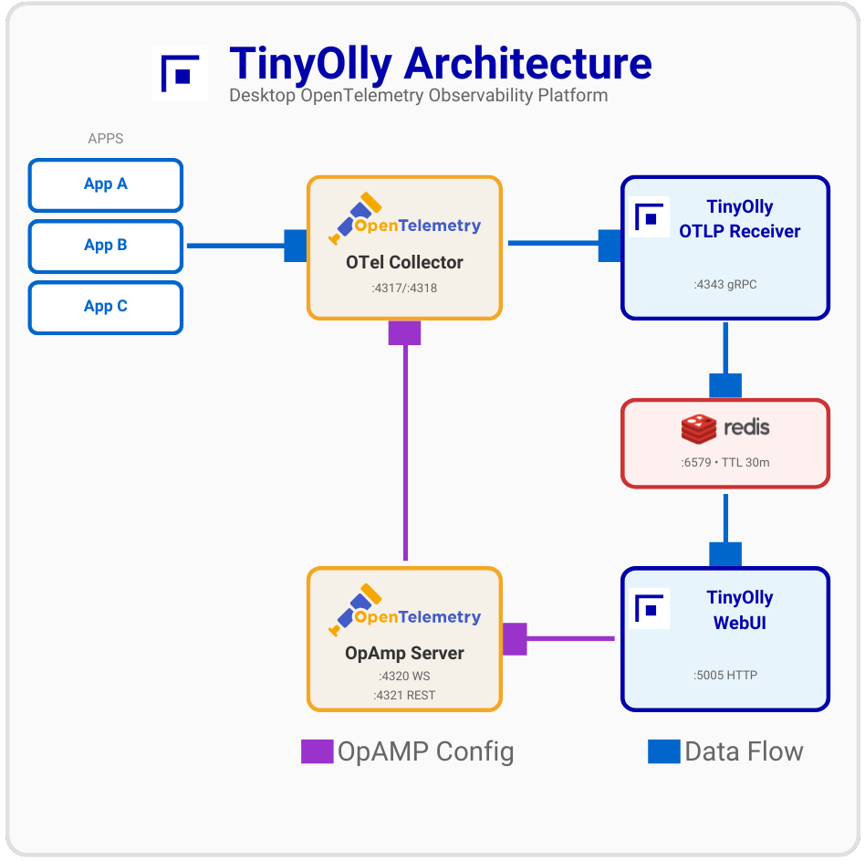

# Technical Details

## Architecture

  

---

## Data Storage

- **Format**: Full OpenTelemetry (OTEL) format for traces, logs, and metrics  
- **SQLite**: All telemetry stored in an embedded SQLite database (compressed with ZSTD + msgpack)  
- **WAL Mode**: Write-Ahead Logging for concurrent reads during writes  
- **Space-Based Retention**: Data is retained until the database reaches its size limit (default 256 MB), then oldest records are evicted automatically. No fixed TTL — data stays as long as there's room  
- **Correlation**: Native trace-metric-log correlation via trace/span IDs  
- **Cardinality Protection**: Prevents metric explosion  
- **Ephemeral by Design**: Designed for local development — data persists across restarts but is evicted when storage fills up  

---

## OTLP Compatibility

TinyOlly is **fully OpenTelemetry-native**:  
- **Ingestion**: Accepts OTLP/gRPC (primary) and OTLP/HTTP  
- **Storage**: Stores traces, logs, and metrics in full OTEL format with resources, scopes, and attributes  
- **Correlation**: Native support for trace/span ID correlation across all telemetry types  
- **REST API**: Exposes OTEL-formatted JSON for programmatic access
- **Control Plane**: OpenTelemetry Collector OpAmp for dynamic configuration  

---

## UI Features

- **Trace Waterfall**: Distributed trace visualization with automatic filtering of noisy ASGI sub-spans (http send/receive)  
- **Trace Map**: Per-trace service dependency graph rendered above the waterfall using Cytoscape.js. Detects inferred external clients from orphan parent span IDs (e.g., test clients that propagate trace context but don't export spans)  
- **Deep Linking**: Shareable URLs that open directly to a specific trace detail view (`?tab=traces&traceId=...`), span search (`?tab=spans&spanId=...`), or filtered tab (`?tab=logs&search=...`). "Copy Link" buttons in trace and span detail views generate these URLs  
- **Click-to-Copy IDs**: Trace and span IDs are copyable with a single click throughout the UI  
- **Correlated Logs**: Trace detail view shows correlated logs inline — click any log row to navigate to the Logs tab filtered by trace ID  
- **Cross-Tab Navigation**: Click trace/span IDs in logs to jump to the corresponding trace or span view  
- **Service Catalog**: RED metrics with action buttons to navigate to Traces, Spans, Logs, or Metrics filtered by service name  
- **Smart Auto-Refresh**: 5-second polling pauses automatically when a search filter is active, preventing result disruption  
- **Scrollable Lists**: Trace, span, and log lists support scrolling with sticky headers for large datasets  